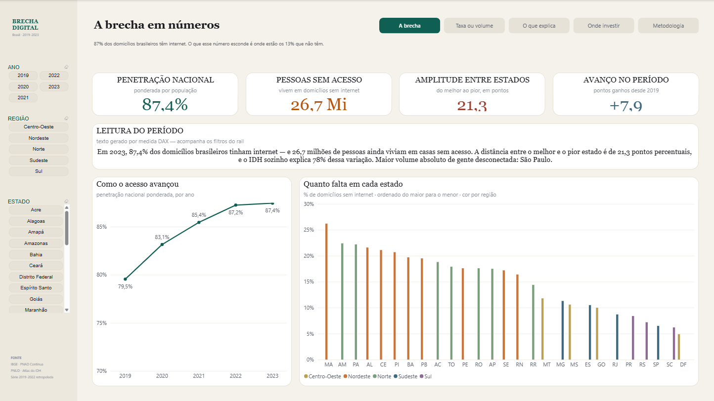
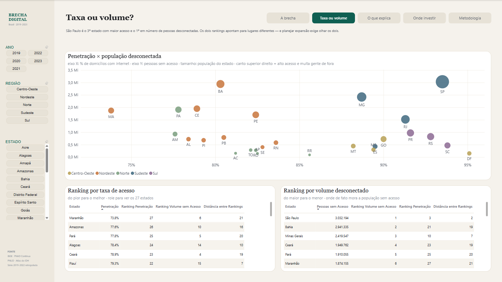
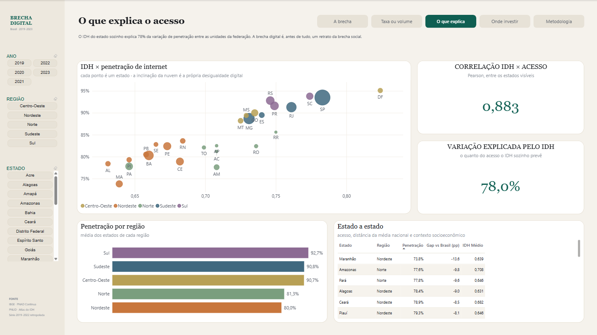
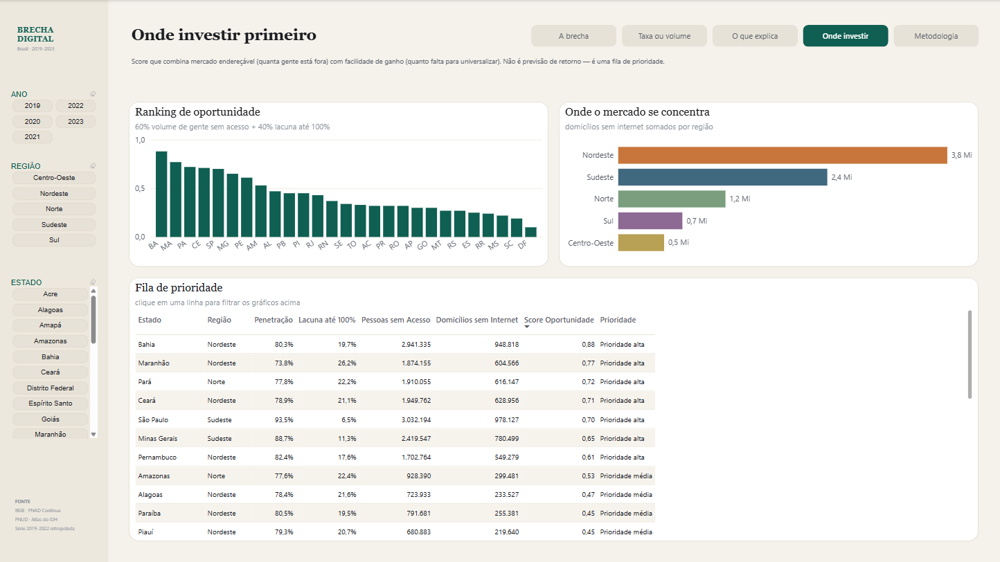
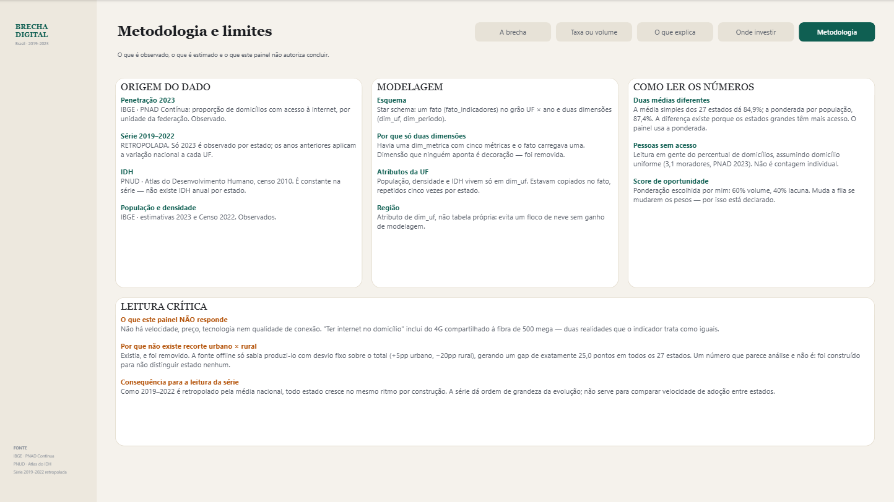

# Brecha Digital no Brasil — Dashboard Power BI

<div align="center">


**Onde está a população brasileira sem internet — e por que o ranking por percentual
aponta para o lugar errado.**

</div>



---

## O achado

92,6% dos domicílios brasileiros tinham internet em 2023. Ainda assim, **5,7 milhões de
domicílios seguem sem acesso** — e eles não estão onde o mapa da desigualdade sugere.

E aqui está a parte que muda decisão: **São Paulo é o 5º estado com maior taxa de acesso
do país e o 1º em número absoluto de domicílios desconectados.** Ranking por percentual e
ranking por volume apontam para lugares diferentes.

| Estado | Taxa de acesso | Posição por taxa | Domicílios sem acesso | Posição por volume |
|---|---:|---:|---:|---:|
| São Paulo | 95,0% | 5º | 852 mil | **1º** |
| Bahia | 89,2% | 22º | 589 mil | **2º** |
| Minas Gerais | 92,8% | 12º | 564 mil | **3º** |
| Acre | 84,4% | **27º** | 43 mil | 23º |

O Acre tem a pior taxa do país e o 23º maior volume: 43 mil domicílios. A Bahia anda
**20 posições** ao trocar um critério pelo outro. Um plano de universalização que ignore
o segundo ranking atende o país inteiro em percentual e quase ninguém em gente.

**O segundo achado é maior que o primeiro: a brecha deixou de ser regional.** O gap entre
Norte+Nordeste e Sul+Sudeste é de 3,5pp. O que restou é a distância entre a cidade e o
campo — **13,0pp no Brasil**, e **24,8pp no Norte**, onde o domicílio urbano tem 95,2% de
acesso (acima da média nacional) e o rural tem 70,4%, o pior do país.

**E o que explica o acesso?** O IDH do estado explica **59% da variação** de penetração
entre as unidades da federação (r = 0,769) — correlação forte, mas mais fraca do que já
foi: como o acesso subiu em toda parte, a variação entre estados comprimiu.

O paradoxo em um gráfico: eixo X é a taxa de acesso, eixo Y é quanta gente está de fora.
Os dois rankings, lado a lado, discordam.



### O que explica o acesso
IDH contra penetração, com a correlação e o R² calculados em DAX — não escritos à mão no
título.



### Onde investir primeiro
Score que combina mercado endereçável com facilidade de ganho, e a fila de prioridade
pronta para uso.



### Metodologia e limites
O que é observado, o que é estimado e o que o painel **não** autoriza concluir.



---

## Honestidade sobre os dados

Este é o ponto que separa um painel bonito de um painel confiável, então fica no topo e
não escondido no rodapé:

| Dado | Situação |
|------|----------|
| Penetração por UF, **2023** | **Observado** — IBGE, PNAD Contínua |
| Penetração por UF, **2016–2025** | **Observado** — série anual da PNAD Contínua, sem retropolação |
| IDH por estado | **Observado** — PNUD, Atlas do Desenvolvimento Humano (censo 2010) |
| População e densidade | **Observado** — IBGE, estimativas 2023 e Censo 2022 |

**Consequência prática:** a série 2016–2025 é observada ano a ano, por estado — dá para
comparar velocidade de adoção entre estados, o que a versão retropolada anterior não
permitia (lá todo estado crescia no mesmo ritmo, por construção).

**2020 não existe na série.** A PNAD Contínua não coletou o módulo de TIC naquele ano por
causa da pandemia. O ponto não é interpolado só para a linha do gráfico ficar contínua —
o buraco é a informação. Isso está dito também na página de metodologia do painel.

### O recorte urbano × rural voltou — e mudou de grão

Ele tinha sido removido. A fonte offline só sabia produzi-lo aplicando um desvio fixo sobre
o total (+5pp urbano, −20pp rural), o que gerava um gap de **exatamente 25,0 pontos
percentuais em todos os 27 estados, em todos os anos**. Um número que parece análise e não
é: não distinguia estado nenhum porque foi construído para não distinguir.

Agora ele está de volta, observado — e é o achado mais forte do painel: **13,0pp no Brasil,
24,8pp no Norte, 7,0pp no Centro-Oeste**. Variar entre regiões é o que faz dele um
indicador em vez de uma decoração.

Uma coisa mudou junto: **o grão**. O IBGE não publica urbano × rural por UF — a amostra da
PNAD não sustenta o cruzamento, e a API devolve `-` para os 27 estados. O recorte existe em
Brasil e Grandes Regiões, e é assim que ele entra no modelo: numa tabela fato **separada**
(`fato_situacao`), não como coluna do fato de UF.

Essa separação é deliberada. Enfiar um indicador de grão regional no fato de UF obrigaria a
repetir o valor da região em cada um dos seus estados — que é exatamente a forma como a
versão anterior produziu um "gap por UF" que não existia.

---

## Camada visual gerada por código

A pasta `Report/definition` dentro do `.pbix` é JSON. [`tools/build_report.py`](tools/build_report.py)
reescreve essa camada inteira a partir de uma especificação declarativa, preservando o
modelo de dados.

```bash
python tools/build_report.py
```

Isso dá grid calculado (nenhum visual 3px fora do alinhamento), formatação definida uma
vez só e revisão do relatório por diff de código.

O design é deliberadamente diferente do meu outro projeto Power BI
([telecom-powerbi-public](https://github.com/HugoLeonardoNz/telecom-powerbi-public)):
lá é escuro, ciano sobre preto, navegação no topo e faixa densa de KPIs; aqui é claro cor
de papel, paleta terrosa, rail vertical à esquerda com os filtros dentro, títulos em
serifa e menos visuais por página. Dashboard não é template — cada assunto pede uma
leitura diferente.

---

## Modelo de dados

```
        ┌──────────────────────────┐
        │   fato_indicadores       │        grão: UF × ano
        │──────────────────────────│        135 linhas
   ┌────┤ id_uf                    ├────┐
   │    │ id_periodo               │    │
   │    │ pct_domicilios_internet  │    │
   │    └──────────────────────────┘    │
   │                                    │
 dim_uf                            dim_periodo
 ──────                            ───────────
 UF · Estado · Região              Ano
 População · Densidade · IDH
```

**Duas dimensões, e isso é intencional.** Havia uma `dim_metrica` anunciando cinco
métricas das quais o fato carregava uma — dimensão que ninguém aponta é decoração, foi
removida. `dim_regiao` também saiu: região é atributo da UF, e mantê-la como tabela
criaria um floco de neve sem ganho.

População, densidade e IDH vivem **só** em `dim_uf`. Estavam copiados no fato, repetidos
cinco vezes por estado — e no caso do IDH, um valor de 2010 fingindo série anual.

---

## Medidas

26 medidas na tabela `_Medidas`, agrupadas por domínio. As que carregam decisão:

| Medida | Por que existe |
|--------|----------------|
| `Penetração Brasil` | Nacional **ponderada por domicílios** (92,6%), diferente da média simples dos 27 estados (91,9%). Os estados grandes têm mais acesso — as duas médias respondem perguntas diferentes e o painel mostra as duas. |
| `Pessoas sem Acesso` | Traduz percentual de domicílios em gente. É o eixo do paradoxo taxa × volume. |
| `Distância entre Rankings` | Quantas posições o estado se move ao trocar taxa por volume. Mede o paradoxo direto: a Bahia anda 20 posições. |
| `Correlação IDH x Penetração` | Pearson calculado em DAX sobre o conjunto filtrado — reage ao slicer, não é número fixo no título. |
| `Score Oportunidade` | 60% volume endereçável + 40% lacuna até 100%. Os pesos são escolha minha, declarada na página de metodologia. |
| `Leitura da Brecha` | Narrativa que lê os próprios números e acompanha os filtros. |

Dicionário completo em [`dax/measures.md`](dax/measures.md).

> Três dessas medidas precisaram reconstruir a série com `REMOVEFILTERS` + reaplicação da
> UF. Sem isso, o `CALCULATE` dentro do iterador herda o filtro do próprio ponto, a série
> de comparação colapsa num valor só e o ranking sai `1` para todo mundo. É uma armadilha
> silenciosa: não dá erro, só devolve número errado.

---

## Reproduzir

```bash
pip install -r requirements.txt
python data_prep/prepare_data.py    # star schema em data/processed/
```

Depois, abrir `digital_divide_brasil.pbix` no Power BI Desktop.

O caminho dos CSVs é o parâmetro **`PastaDados`** do Power Query. Ao clonar em outra
máquina: *Transformar dados → Gerenciar parâmetros → PastaDados*, apontando para a pasta
`data/processed` local.

> O script tenta a API SIDRA do IBGE primeiro e cai para a base offline embutida quando a
> API está fora (ela retorna 500 com frequência). O aviso aparece no console.

---

## Stack

`Python 3.x` · `pandas` · `requests` · `Power BI Desktop` · `DAX` · `Power Query (M)` ·
`PBIR` (formato JSON do relatório)

---

## Autor

**Hugo Leonardo**
Analista de Dados Pleno — SQL · Python · Power BI
Speed Fibra · Santa Luzia, MG

[](https://www.linkedin.com/in/hugo-leonardo-data-analyst/)
[](https://github.com/HugoLeonardoNz)
